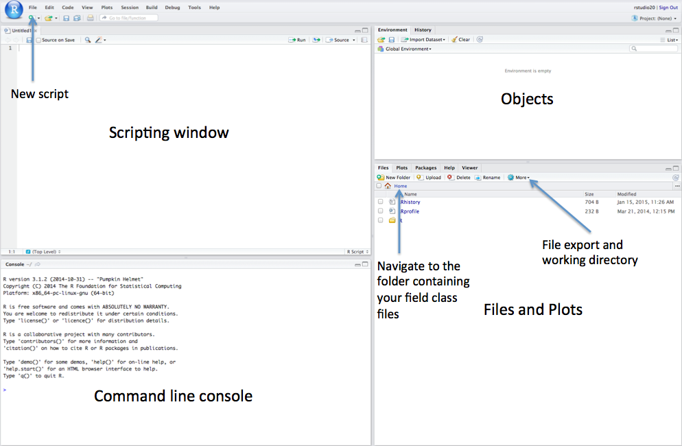

# Understanding Data

## Introduction
This week's content focuses on **understanding data**. Some of you, however, may wonder why taking a statistical methods course is necessary in the first place? Besides it being a requirement, there are several compelling reasons to have a (basic) knowledge of data and statistics:

- it will help you to understand and critically engage with academic articles;
- it will help you critically assess statistics used in the media, government reports, etc.;
- it will help you write a dissertation based on secondary analysis;
- it will help you write your own work convicingly.

Further to this, data skills are in high demand by employers both in the public and private sectors. 

<div class="note">
**TL;DR**: Knowing how to collect data, compile data from different sources, and analyse that data is very important.
</div>

### Video: Overview {#overview_w01}
```{r 01-short-lecture-welcome, warnings=FALSE, message=FALSE, echo=FALSE}
# library(vembedr)
# embed_msstream('') %>% use_align('left')
# welcome to this week
# why take research methods
```
[Lecture slides] [[Watch on MS stream]]()

## R
The best way of learning about data is by working with data and getting your hands dirty. Before we will introduce some statistical methodology and talk about something called descriptive statistics, we will first have a look at one of the software tools with which we will be working this semester: [R](). R is a free software environment for statistical computing and graphics. It is extremely powerful and as such is now widely used for academic research as well as in the commercial sector. Ever wondered how those excellent [graphs created by the Financial Times](https://ig.ft.com/coronavirus-global-data/) have been created?

### Video: R
```{r 01-r, warnings=FALSE, message=FALSE, echo=FALSE}
# library(vembedr)
# embed_msstream('') %>% use_align('left')
# what is R
# why R
```
[Lecture slides] [[Watch on MS stream]]()

Unlike software such as [Excel]() or [SPSS](), the user has to type commands to get it to execute tasks such as loading in a dataset or performing a calculation. The biggest advantage of this approach is that you can build up a document, or script, that provides a record of what you have done, which in turn enables the straightforward repetition of tasks. Graphics can be easily modified and tweaked by making slight changes to the script or by scrolling through past commands and making quick edits. Unfortunately command-line computing can also be off-putting at first. It is easy to make mistakes that aren't always obvious to detect. Nevertheless, there are good reasons to stick with R. These include:

- It's broadly intuitive with a strong focus on publishable-quality graphics.
- It’s 'intelligent' and offers in-built good practice – it tends to stick to statistical conventions and present data in sensible ways.
- It’s **free**, cross-platform, customisable and extendable with a whole swathe of libraries ('add ons') including those for discrete choice, multilevel and longitudinal regression, and mapping, spatial statistics, spatial regression, and geostatistics.
- It is well respected and used at the world's largest technology companies (including Google, Microsoft and Facebook, and at hundreds of other companies.
- It offers a **transferable skill** that shows to potential employers experience both of statistics and of computing.

The intention of the practical elements of this week's content, is to provide a thorough introduction to R to get you started:

1. The basic programming principles behind R.
2. Loading in data from `csv` files and subsetting it into smaller chunks.
3. Calculating a number of descriptive statistics for data exploration and checking.
4. Creating basic and more complex plots in order to visualise the distributions values within a dataset.

R has a steep learning curve, but the benefits of using it are well worth the effort. Take your time and think through every piece of code you type in. The best way to learn R is to take the basic code provided in tutorials and experiment with changing parameters - such as the colour of points in a graph - to really get 'under the hood' of the software. Take lots of notes as you go along and if you are getting really frustrated take a break!

<blockquote class="twitter-tweet tw-align-center"><p lang="en" dir="ltr">Following a coding tutorial<a href="https://t.co/dXUfp0WWv7">pic.twitter.com/dXUfp0WWv7</a></p>&mdash; Tawanda Nyahuye👨
💻 (@towernter) <a href="https://twitter.com/towernter/status/1332692092863340544?ref_src=twsrc%5Etfw">November 28, 2020</a></blockquote> <script async src="https://platform.twitter.com/widgets.js" charset="utf-8"></script>

### Getting started with R
You can [download and install R]() on your laptop but for the purposes of this course we would like you to use the version hosted on the UCL servers so that everyone participating in the course has access to the same version of the software.
Open a web browser and navigate to: https://rstudio.rc.ucl.ac.uk/
Log in with your **usual UCL username and password**. You should see the RStudio interface appear.

```{r 01-rstudio-interface, echo=FALSE, fig.align='center', fig.cap='The RStudio interface.'}
#
```

If you managed to log onto RStudio server: brilliant, we are ready to go. At its absolute simplest R is a calculator, so let's try adding some numbers by typing and hitting enter to execute the code:

```{r 01-simple-calculate, warnings=FALSE, message=FALSE}
4 + 10
```

You will notices that in the command line window, it will give you an answer directly (i.e. 14). These outputs of the command line window are shown as `##` throughout this handbook and you **do not** need to type  anything into the command line that follows `##` (because it simply  shows the result of a command!). 

<div class="note">
Anything that appears as red in the command line means it is an error (or a warning) so you will likely need to correct your code. If you see a **>** on the left it means you can type in your next line, a + means that you haven't finished the previous line of code. As will become clear, + signs often appear if you don't close brackets or you did not properly finish your command in a way that R expected.
</div>

Rather than using numbers and values, it is often easier to assign numbers (or groups of them) a memorable name for easy reference later. In R terminology this is called **creating an object** and this is really important. Let's try this:

```{r 01-create-objects, warnings=FALSE, message=FALSE}
a <- 4
b <- 10
```

The **<-** symbol is used to assign the value to the name, in the above we assigned the integer **4** to an **object** with the name *a*. Similarly, we assigned the integer **10** to an **object** with the name *b* To see what each object contains you can just type `print(name of your object)`, so in our case:

```{r 01-inspecting-those-objects, warnings=FALSE, message=FALSE}
print(a)
print(b)
```

This may look trivial, but in fact it is extremely powerful as **objects** can be treated in the same way as the numbers they contain. For instance:

```{r 01-treat-those-objects, warnings=FALSE, message=FALSE}
a*b
```

Or even used to create new objects:

```{r 01-object-from-objects, warnings=FALSE, message=FALSE}
ab <- a*b
print(ab)
```

You can generate a list of objects that are currently active using the `ls()` command. R stores objects in your computer's RAM so they can be processed quickly. Without saving (we will come onto this below) these objects will be lost if you close R (or it crashes).

```{r 01-list-the-objects, warnings=FALSE, message=FALSE}
ls()
```

You may wish to delete an object. This can be done using `rm()` with the name of the object in the brackets. For example:

```{r 01-delete-an-object, warnings=FALSE, message=FALSE}
rm(ab)
```

To confirm that your command has worked, just run the `ls()` command again:

```{r 01-cofirm-delete, warnings=FALSE, message=FALSE}
ls()
```

## Statistical terminology
Let's now take a short break from RStudio and have a look at some theory: the video below will introduce you to some essential statistical terminology.

### Video: Essential Statistical Terminology
```{r 01-statistical-terminology, warnings=FALSE, message=FALSE, echo=FALSE}
# library(vembedr)
# embed_msstream('') %>% use_align('left')
# statistical terminology
# types of variables
```
[Lecture slides] [[Watch on MS stream]]()

Now we now a little more about variables, we can go back to RStudio. Until now our objects have been extremely simple integers (and you should now know what integers are!), but the real power of R comes when we can begin to execute functions on objects. Let's check this out by firstly building a more complex object through the `c()` function. The **c** in the `c()` function means concatenate and essentially groups things together. Let's create an object that contains the (fictional) birth years of the six main characters in the popular American television sitcom [Friends]().

```{r 01-friends-dob, warnings=FALSE, message=FALSE}
friends_dob <- c(1974,1977,1977,1979,1975,1976)
```

Let's check the results.

```{r 01-friends-dob-show, warnings=FALSE, message=FALSE}
print(friends_dob)
```

Now, we can execute some statistical functions on this object such as cacluating the `mean()` value, the `median()` value, and the `range()` of the data.

```{r 01-mean-friends, warnings=FALSE, message=FALSE}
mean(friends_dob)
median(friends_dob)
range(friends_dob)
```

All functions need a series of arguments to be passed to them in order to work. These arguments are typed within the brackets and typically comprise the name of the object (in the examples above its the `friends_dob`) that contains the data followed by some parameters. The exact parameters required are listed in the functions help files. To find the help file for the function type `?` followed by the function name, for example:

```{r 01-mean-help, warnings=FALSE, message=FALSE, eval=FALSE}
?mean
```

All helpfiles will have a **usage** heading detailing the parameters required. In the case of the mean you can see it simply says `mean(x, ...)`. In function helpfiles `x` will always refer to the object the function requires and, in the case of the mean, the `...` refers to some optional arguments that we don't need to worry about.

<div class="note">
When you are new to R the help files can seem pretty impenetrable (because they often are!). Up until relatively recently these were all people had to go on, but in recent years R has really taken off and so there are plenty of places to find help and tips. Google is best tool to use. When people are having problems they tend to post examples of their code online and then the R community will correct it. One of the best ways to solve a problem is to paste their correct code into your R command line window and then gradually change it for your data an purposes.
</div>

The structure of the `friends_dob` object - essentially a group of numbers (integers!) - is known as a **vector object** in R. To build more complex objects that, for example, resemble a spreadsheet with multiple columns of data, it is possible to create a class of objects known as a **data frame**. This is probably the most commonly used class of object in R. We can create one here by combining two vectors.

```{r 01-make-a-df, warnings=FALSE, message=FALSE}
friends_characters <- c('Monica','Ross','Rachel','Joey','Chandler','Phoebe')
friends <- data.frame(friends_characters,friends_dob)
```

If you type `print(friends)` you will see our data frame.

```{r 01-print-the-df, warnings=FALSE, message=FALSE}
print(friends)
```

#### Tips {-}
1. R is case sensitive so you need to make sure that you capitalise everything correctly if required.
2. The spaces between the words don't matter but the positions of the commas and brackets do. Remember, if you find the prompt, >, is replaced with a + it is because the command is incomplete. If necessary, hit the escape (esc) key and try again.
3. It is important to come up with good names for your objects. In the case of the `friends_dob` object we used a underscore to separate the words. It is good practice to keep the object names as short as posssible so we could have gone for `FriendsDob` or `f_dob`. Be aware: you cannot start an object name with a number!
4. If you press the up arrow in the command line you will be able to edit the previous lines of code you inputted.

#### Recap {-}
In this section you have:

1. Entered your first commands into the R command line interface.
2. Created objects in R.
3. Created a vector of values (the `friends_dob` object).
4. Executed some simple R functions.
5. Created a data frame (called `friends`).

## Descriptive statistics

### Video: Descriptive statistics
```{r 01-descriptive-statistics, warnings=FALSE, message=FALSE, echo=FALSE}
# library(vembedr)
# embed_msstream('') %>% use_align('left')
# what are descriptive statistics
# frequency distribution
```

In the previous section, R may have seemed fairly labour-intensive. We had to enter all our data manually and each line of code had to be written into the command line. Fortunately this isn't routinely the case. In RStudio look to the top left corner and you will see a plus symbol, click on it and select **R Script**.

This should give you a blank document that looks a bit like the command line. The difference is that anything you type here can be saved as a script and re-run at a later date. When writing a script it is important to keep notes about what each step is doing. To do this the hash (`#`) symbol is put before any code. This comments out that particular line so that R ignores it when the script is run. Type the following into the script:

```{r 01-script-it, warnings=FALSE, message=FALSE, eval=FALSE}
# first attempt at creating a script
Some.Data <- data.frame(0:10,20:30)
print(Some.Data)
```

#### Question {-}
1. Without running these lines of code, what do you expect to happen? Do you understand what these simple line of codes do?

In the scripting window if you highlight all the code you have written and press the **Run** button on the top on the scripting window you will see that the code is sent to the command line and the text on the line after the `#` is ignored. From now on you should type your code in the scripting window and then use the **Run** button to execute it. If you have an error then edit the line in the script and hit run again.

Try it:
```{r 01-script-it-for-real, warnings=FALSE, message=FALSE}
# first attempt at creating a script
Some.Data <- data.frame(0:10,20:30)
print(Some.Data)
```

The My.Data object is a data frame in need of some sensible column headings. You can add these by typing:

```{r 01-add-column names, warnings=FALSE, message=FALSE}
# add column names
names(Some.Data)<- c('x','y')

# print the object to check names were added successfully
print(Some.Data)
```

Until now we have generated the data used in the examples above. One of R's great strengths is its ability to load in data from almost any file format. Comma Separated Value (`csv`) files are our preferred choice. These can be thought of as stripped down Excel spreadsheets. They are an extremely simple format so they are easily machine readable and can therefore be easily read in and written out of R. Since we are now reading and writing files it is good practice to tell R what your working directory is. Your working directory is the folder on the computer where you wish to store the data files you are working with. You can create a folder called `POLS0008`, for example. If you are using RStudio, on the lower right of the screen is a window with a **Files** tab. If you click on this tab you can then navigate to the folder you wish to use. You can then click on the **More** button and then **Set as Working Directory**. You should then see some code similar to the below appear in the command line. It is also possible to type the code in manually.

```{r 01-set-wd, warnings=FALSE, message=FALSE, eval=FALSE}
# set the working directory path to the folder you wish to use
# you may need to create the folder first if it doesn't exist
setwd('~/POLS0008') 
# note the single / (\\ will also work)
```

Once the working directory is setup it is then possible to load in a `csv` file. We are going to load a dataset that has been saved in the working directory we just set that shows London's historic population for each of its Boroughs.

#### File download {-}
| File                                                 | Type           | Link |
| :------                                              | :------        | :------ |
| Borough Population London        | `csv`          | [Download]() |

Once downloaded to your own computer, this file will then need to be uploaded into RStudio. To do this click on the **Upload** button in the files area of the screen. Select the `csv` file you just downloaded and press **OK**. We can then type the following to locate and load in the file we need.

```{r 01-load-csv, warnings=FALSE, message=FALSE, eval=FALSE}
# load csv file from working directory
London.Pop <- read.csv('census-historic-population-borough.csv')
```

```{r 01-load-csv-for-realz, warnings=FALSE, message=FALSE,echo=FALSE}
# load csv file from working directory
London.Pop <- read.csv('raw/census-historic-population-borough.csv')
```

To view the object type:

```{r 01-view-da-pop, warnings=FALSE, message=FALSE,echo=FALSE}
print(London.Pop)
```

Or if you only want to see the top 10 or bottom 10 rows you can use the `head()` and `tail()` commands. These are particularly useful if you have large datasets!

```{r 01-head-to tail, warnings=FALSE, message=FALSE,echo=FALSE}
head(London.Pop)
tail(London.Pop)
```

To get to know a bit more about the file you have loaded R has a number of useful functions. We can use these to find out how many columns (**variables**) and rows (**cases**) the data frame (**dataset**) contains.

```{r 01-numbers-of-that-df, warnings=FALSE, message=FALSE,echo=FALSE}
# get the number of columns
ncol(London.Pop)

# get the number of rows
nrow(London.Pop)

# list the column headings
names(London.Pop)
```

Given the number of columns in the pop data frame, subsetting by selecting on the columns of interest would make it easier to handle. In R there are two was of doing this. The first uses the `$` symbol to select columns by name and then create a new data frame object.

```{r 01-2011-only, warnings=FALSE, message=FALSE,echo=FALSE}
# select the columns containing the Borough names and the 2011 population
London.Pop.2011<- data.frame(London.Pop$Area.Name, London.Pop$Persons.2011) 

# inspect the results
head(London.Pop.2011)
```

A second approach to selecting particular data is to use `[Row, Column]`. For instance:

```{r 01-select-those-rows, warnings=FALSE, message=FALSE,echo=FALSE}
# select the 1st row of the 2nd column
London.Pop[1,2]

# select the first 5 rows of the 1st column
London.Pop[1:5,1]

# select the first 5 rows of columns 8 to 11
London.Pop[1:5,8:11]

# assign the previous selection to a new object
London.Subset <- London.Pop[1:5,8:11]
```

In the code snippet, note how the colon `:` is used to specify a range of values. We used the same technique to create the `Some.Data` object above. The abilty to select particular columns means we can see how the population of London's Boroughs have changed over the past century.

```{r 01-change-pop, warnings=FALSE, message=FALSE,echo=FALSE}
# within the brackets you can add additional columns to the data frame 
# as long as their separated by commas
Pop.Change<- data.frame(London.Pop$Area.Name, London.Pop$Persons.2011 - London.Pop$Persons.1911)
```

If you type `head(PopChange)` you will see that the population change column (created to the right of the comma above) has a very long name. This can be changed using the `names()` command in the same way as we did this for our `Some.Data` object.

```{r 01-whats-in-a-name, warnings=FALSE, message=FALSE,echo=FALSE}
names(Pop.Change)<- c('Borough', 'Change_1911_2011')
```

Since we have done some new analysis and created additional information it would be good to save the `PopChange` object to our working directory. This is done using the code below. Within the brackets we put the name of the R object we wish to save on the left of the comma and the file name on the right of the comma (this needs to be in inverted commas). Remember to put `.csv` after since this is the file format we are saving in.

```{r 01-write-to-disk, warnings=FALSE, message=FALSE,echo=FALSE}
write.csv(Pop.Change, 'Population_Change_1911_2011.csv')
```

#### Recap {-}
In this section you have learnt how to:

1. Create an R script.
2. Load a `csv` into R, perform some analysis, and write out a new `csv` file to your
working directory.
3. Subset R data frames by name and also column and/or row number.

#### Seminar assignment {-}
Create a `csv` file that contains the following columns:

1. The names of the London Boroughs.
2. Population change between 1811 and 1911.
3. Population change between 1911 and 1961.
4. Population change 1961 and 2011.

#### Seminar questions {-}

1. Which Boroughs had the fastest growth during the 19th Century, and which had the slowest?
2. You may have noticed that there is an additional column in the pop data frame called `Borough-Type`. This indicates if a Borough is in inner (1) or outer (2) London. Is this variable ordinal or nominal?

## Done
Save your R script by pressing the Save button in the script window. That is it for this week.