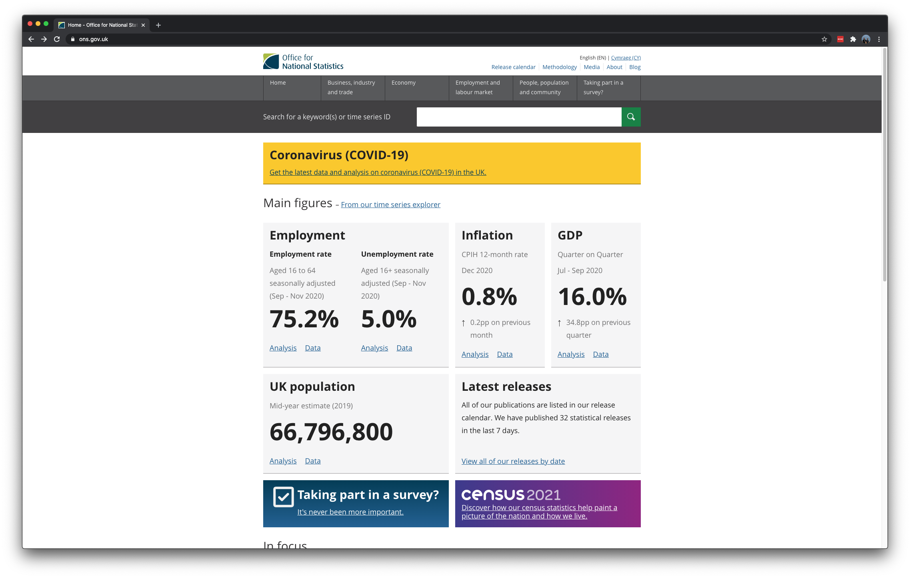
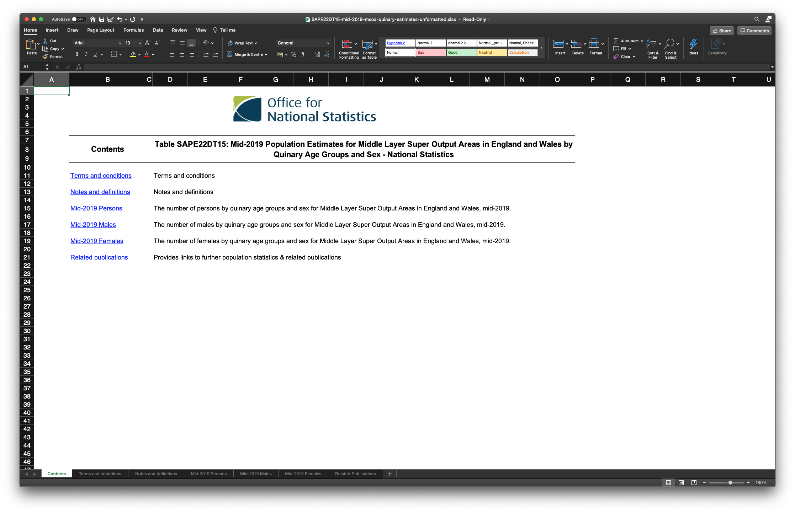
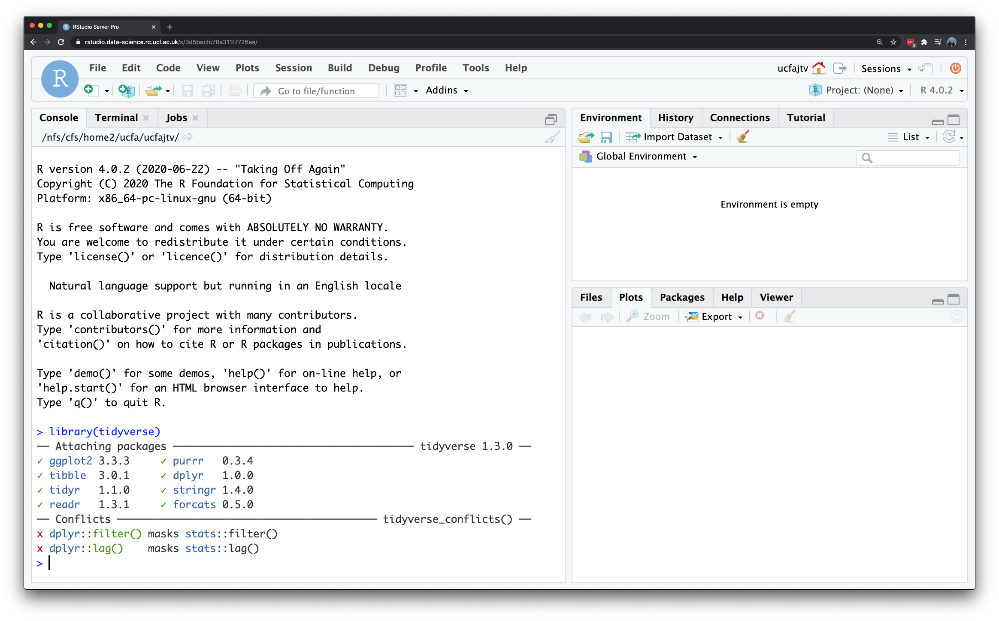

# Sourcing data

## Introduction {#introduction-w04}
Welcome to your fourth week of **Introduction to Quantitative Research Methods**. This week we will introduce you to how to prepare and structure your data from official sources. For the tutorial we will apply what we have learnt over the past weeks onto a new data set.

This week is structured by **3** short videos, practical material that you need to work through in preparation for Thursday's seminar, and a seminar task that you need to do in preparation for Thursday's seminar.

Let's do it.

#### Video: Introduction W4 {-}
```{r 04-short-lecture-welcome, warnings=FALSE, message=FALSE, echo=FALSE}
library(vembedr)
embed_msstream('') %>% use_align('left')
```
[Lecture slides] [[Watch on MS stream]]()

```{r 04-settings, warnings=FALSE, message=FALSE, echo=FALSE}
# settings
options(max.print=30)
```

### Reading list {#reading-list-w04}
Please find the reading list for this week below. We strongly recommend that you read the **core reading material** before you continue with the rest of this week's material.

#### Core reading {-}
- Wickham, 2014, Tidy data, *Journal of Statistical Software* 59(10). [[Link]](http://www.jstatsoft.org/v59/i10/paper)

#### Supplementary reading {-}

### Q&A session
This week there is **NO** live Q&A session scheduled. Please post any questions you have on the [POLS0008 Forum](https://moodle.ucl.ac.uk/mod/forum/view.php?id=1632137) or ask them to your seminar leader during your live seminar on Thursday.

## Sourcing data
Over the past weeks we have predominantly worked with two data sets: `ambulance-assault.csv` and `census-historic-population-borough.csv`. Although very convenient, in many cases the data that you want are not readily available on as a download on Moodle and you will need to source the data yourself, for instance, by downloading a data set that has been created by a statistical authority such as the [Office for National Statistics](https://www.ons.gov.uk/) [UK], [United States Census Bureau](https://www.census.gov/) [USA], [Statistics South Africa](http://www.statssa.gov.za/) [ZA], or the [National Bureau of Statistics of China](http://www.stats.gov.cn/english/) [CN]. Or perhaps you require a data set compiled by large international institutions like [World Bank](https://www.worldbank.org/) or [Unicef](https://www.unicef.org/)? No matter what your source, you will have to know how to download and prepare your data so that you can conduct your analysis in R.

#### Video: Sourcing data {-}
```{r 04-sourcing-data, warnings=FALSE, message=FALSE, echo=FALSE}
embed_msstream('') %>% use_align('left')
```
[[Lecture slides]]() [[Watch on MS stream]]()

Within the United Kingdom, the [Office for National Statistics](https://www.ons.gov.uk/) (ONS) is the largest producer of official statistics. ONS is responsible for collecting and publishing statistics related to the economy, population and society at national, regional and local levels. They are also responsible to conduct the census in England and Wales every 10 years (the census for Scotland and Norther Ireland are conducted by the [National Records of Scotland](https://www.nrscotland.gov.uk/) and the [Northern Ireland Statistics and Research Agency](https://www.nisra.gov.uk/). Today we will be downloading a data set from ONS, prepare the data set as a `csv` file, and read our freshly created `csv` file into R.

```{r 04-ons-website, echo=FALSE, fig.align='center', fig.cap='The website of the Office for National Statistics.'}

```

The population data in the `census-historic-population-borough.csv` we have been working with so far only goes as far as 2011, so in the following we will try to get some more recent population estimates. ONS releases every year their Middle Super Output Area [mid-year population estimates](https://www.ons.gov.uk/peoplepopulationandcommunity/populationandmigration/populationestimates/datasets/middlesuperoutputareamidyearpopulationestimates) for England and Wales, the latest data set that has been released is 2020. This is the data set that we are going to download and prepare.

<div class="note">
**Note**<br/>
These [Middle Super Output Areas](https://www.ons.gov.uk/methodology/geography/ukgeographies/censusgeography) are one of the many administrative geographies that the ONS uses for reporting their small area statistics. 
</div>

To download the data set, you need to take the following steps:

1. Navigate to the download page of the Middle Super Output Area population estimates which can be found here: [[Link]](https://www.ons.gov.uk/peoplepopulationandcommunity/populationandmigration/populationestimates/datasets/middlesuperoutputareamidyearpopulationestimates)
2. Download the file `Mid-2019: SAPE22DT15` to your computer.
3. As the file that you have now downloaded is a `zip` file, we first **need** to extract the file before we can use it. To unzip the file you can use, for instance, [7-Zip](https://www.7-zip.org/) on Windows or [The Unarchiver](https://theunarchiver.com/) on Mac OS.
4. Open the file in Microsoft Excel or any other spreadsheet software for inspection. 
5. Once opened your file should look simlir as to the screenshot below.

```{r 04-mid-year-download, echo=FALSE, fig.align='center', fig.cap='The `Mid-2019: SAPE22DT15` file that we downloaded.'}

```

The file probably does not look exactly like you thought it would because we do not directly see any data as, in fact, all the data is put on different tabs. The data that we want is found on the `Mid-2019 Persons` tab. The problem we have now, however, is that the data as it is right now cannot be read into R without causing us lots of problems down the road. So even though we have our data, we are not yet ready to read our data set into R! So, in video below, we will show you how to create a `csv` from the data that we want to use. 

#### Video: Preparing data {-}
```{r 04-preparing-data, warnings=FALSE, message=FALSE, echo=FALSE}
embed_msstream('') %>% use_align('left')
```
[Lecture slides] [[Watch on MS stream]]()

Now you have seen how to prepare your `csv`, it is time to do it yourselves. Just as a small recap, these are the steps that you need to take to turn the downloaded data into a `csv`:

1. Go to the `Mid-2019 Persons` tab.
2. Highlight the columns: *MSOA Code*, *MSOA Name*, *LA Code (2019 boundaries)*, *LA name (2019 boundaries)*, *LA Code (2020 boundaries)*, *LA name (2020 boundaries)*, and *All Ages*. Make sure that you do not include any of the whitespace or empty rows.
3. Scroll down all the way to the bottom of the file and whilst holding the **shift** button, click on the last value in the *All Ages* column. This value should be 9,711. 
4. Now all the data that we need are selected we can copy them by right clicking and in the context menu opting for the **copy** option. Of course, you can also simply use `control` + `c` (Windows) or `command` + `c` (Mac OS).
5. Open a new, empty spreadsheet and paste the copied data into this new, empty spreadsheet by right clicking in the first cell and in the context menu opting for the **paste** option. Of course, you can also simply use `control` + `v` (Windows) or `command` + `v` (Mac OS).
6. Now save this file as a `midyear2019.csv`. Make sure that you select `csv` as your file format (e.g. `CSV UTF8 (Comma-delimited) (.csv)`).

Now, for the moment of truth: let's try and see if we can load our data into R! Of course, start by uploading your `csv` file to RStudio Server and setting your working directory so that R can find the file. 

```{r 04-load-csv, warnings=FALSE, message=FALSE, eval=FALSE}
# load csv file from working directory
midyear <- read.csv('midyear2019.csv')
```

```{r 04-load-csv-for-realz, warnings=FALSE, message=FALSE, echo=FALSE}
# load csv file from working directory
midyear <- read.csv('raw/midyear2019.csv')

# inspect
midyear
```

#### Questions {-}
1. Inspect the columnames. Why do they slightly differ from the ones that we saw in Microsoft Excel?
2. How many rows does the `midyear` dataframe have?
3. How many columns does the `midyear` dataframe have?

The column names may seem a little complicated but in fact simply refer to some of the administrative geographies that the ONS uses for their statistics. Don't worry if you do not fully understand these, these are notoriously complicated!

| Column heading | Full name | Description |
| :---           | :---      | :---------- |
|**MSOA.Code** | MSOA Code | [Middle Super Output Areas](https://www.ons.gov.uk/methodology/geography/ukgeographies/censusgeography) are one of the many administrative geographies that the ONS uses for reporting their small area statistics. These codes are used as a quick way of referring to them from official data sources. |
|**MSOA.Name** | MSOA Name | Name of the MSOA. |
|**LA.Code..2019.boundaries** | Local Authority District codes 2019 | [Local Authority Districts](https://en.wikipedia.org/wiki/Districts_of_England) are a subnational division used for the purposes of local government. Each MSOA belongs to one Local Authority District, however, between years the boundaries of these Local Authority Districts sometimes change. These are the codes for the Local Authority District to which the MSOA belonged to in 2019. |
|**LA.name..2019.boundaries** | Local Authority District names 2019 | Name of the Local Authority District to which the MSOA belonged to in 2019. 
|**LA.Code..2020.boundaries** | Local Authority District codes 2020 | Code of the Local Authority District to which the MSOA belonged to in 2020 |
|**LA.name..2020.boundaries** | Local Authority District names 2020 | Name of the Local Authority District to which the MSOA belonged to in 2019. 
|**All.Ages** | Total number of people | The total number of people that is estimated to live in the MSOA mid-2019. |

Now we at least have an idea what our column names mean, we can rename them so that they are a little more intelligible.

```{r 04-rename-columns, warnings=FALSE, message=FALSE}
# rename columns
names(midyear) <- c('msoa_code','msoa_name','lad19_code','lad19_name','lad20_code','lad20_name','pop19')

# inspect
names(midyear)
```

#### Recap {-}
In this section you have learnt how to:

1. Download data from the Office for National Statistics.
2. Select the data that you need and save these into a `csv` file.
2. Load the `csv` file that you created into R.

## Structuring data
Over the past weeks a lot of information has come your way. However, whilst you are slowly becoming proficient in using R, it is now a good moment to think a little bit more about the data that we have been using and how the data sets have been organised This is crucial for when you are moving on to working on your own projects where you have to source data yourselves: the vast majority of the data you will find in the public domain (or private domain for that matter) will be **dirty data**. With dirty data we mean data that needs some form of pre-processing, cleaning, and linkage before you can use it for your analysis.

In the following, you will learn a consistent way to structure your data in R: **tidy data**. Tidy data, as formalised by [R Wizard Hadley Wickham](http://hadley.nz/) in his contribution to the [Journal of Statistical Software](http://www.jstatsoft.org/v59/i10/paper) is not only very much at the core of the `tidyverse` R package that we will introduce you to, but also of general importance when organising your data. In the words, of [the Wizard](https://r4ds.had.co.nz/tidy-data.html):

> Once you have tidy data and the tidy tools provided by packages in the tidyverse, you will spend much less time munging data from one representation to another, allowing you to spend more time on the analytic questions at hand.

#### Video: Preparing data {-}
```{r 04preparing-data, warnings=FALSE, message=FALSE, echo=FALSE}
embed_msstream('') %>% use_align('left')
```
[[Lecture slides]]() [[Watch on MS stream]]()

Base R
Introduced to ggplot2, but

we first have to install the `tidyverse` package using the `install_packages()` function in the same way as we installed the `ggplot2` package [last week](examining-data-ii.html#video-installing-packages-in-r).

```{r 04-installing-tidyverse, warnings=FALSE, message=FALSE, eval=FALSE}
# install the tidyverse 
install.packages('tidyverse')
```

<div class="note">
**Note**<br/>
The `tidyverse` package is in fact a collection of packages that are designed for data science tasks. Where in many cases different packages work all slightly differently, all packages of the `tidyverse` share the underlying design philosphy, grammar, and data structures. The `ggplot2` package that you worked with last week is in very fact one of the core package of the `tidyverse`. Because the `tidyverse` consists of multiple packages, it may take a little while before everything is installed so be patient! For more information on `tidyverse`, have a look at https://www.tidyverse.org/.
</div>

If your installation was successful, you can now load the `tidyverse` as follows:

```{r 04-loading-tidyverse, warnings=TRUE, message=TRUE}
# load the tidyverse 
library(tidyverse)
```

```{r 04-figure-load-tidyverse, echo=FALSE, fig.align='center', fig.cap='Loading the tidyverse.'}

```

After loading, you may get a short information messages to inform you which packages are attached to your R session and whether there are any conflicting functions. This simply means that there are functions that are named the same across the packages that you have loaded. When you load the `tidyverse` in a fresh R session, these conflicts will include two functions: `filter()` and `lag()`. The `dplyr` package, which is one of the `tidyverse` packages, 

You can represent the same underlying data in multiple ways. The example below, taken from the the `tidyverse` package and described in the [R for Data Science](https://r4ds.had.co.nz/tidy-data.html) book, shows that the same data can organised in four different ways. Before we look at the data, 

Table **1**:
```{r 04-tidyverse-table1, warnings=FALSE, message=FALSE}
table1
```

Table **2**:
```{r 04-tidyverse-table2, warnings=FALSE, message=FALSE}
table2
```

Table **3**:
```{r 04-tidyverse-table3, warnings=FALSE, message=FALSE}
table3
```

Table **4a**:
```{r 04-tidyverse-table4a, warnings=FALSE, message=FALSE}
table4a
```

Table **4b**:
```{r 04-tidyverse-table4b, warnings=FALSE, message=FALSE}
table4b
```

None of these representations are wrong per se, however, not are equally easy to use. Only Table **1** can be considered as tidy data because it is the only table that adheres to the three rules that make a dataset tidy:

1. Each variable must have its own column.
2. Each observation must have its own row.
3. Each value must have its own cell.

```{r 05-figure-hadley-wickham, echo=FALSE, fig.align='center', fig.cap='A visual representation of tidy data by [Hadley Wickham](https://r4ds.had.co.nz/tidy-data.html).'}
knitr::include_graphics('images/week04/04_tidy_data.png')
```

Fortunately, there are some functions in the `tidyr` and `dplyr` packages, both part of the `tidyverse` that will help us cleaning and preparing our datasets to create a **tidy dataset**. The most important and useful functions are:

| Package   | Function          | Use to |
| :------   | :------           | :------ |
| dplyr	    | select            | select columns |
| dplyr	    | filter            | select rows |
| dplyr	    | mutate            | transform or recode variables |
| dplyr	    | summarise         | summarise data |
| dplyr	    | group by          | group data into subgropus for further processing |
| tidyr	    | pivot_longer      | convert data from wide format to long format |
| tidyr	    | pivot_wider       | convert long format dataset to wide format |

<div class="note">
**Note**<br/>
Remember that when you encounter a function in a piece of R code that you have not seen before and you are wondering what it does that you can get access the documentation through `?name_of_function`, e.g. `?pivot_longer`. For almost any R package, the documentation contains a list of arguments that the function takes, in which format the functions expects these arguments, as well as a set of usage examples.
</div>

#### Recap {-}

## Seminar {#seminar-w04}
Please find the seminar task and seminar questions for this week's seminar below. 

<div class="note">
**Note**<br/>
Please make sure that you have executed the seminar task and have answered the seminar questions before the seminar!
</div>

#### Seminar task {-}

#### Seminar questions {-}

#### Seminar link {-}
Seminars for all groups take place on **Thursday morning**. You can find the **Zoom** link to your seminar group on [Moodle](https://moodle.ucl.ac.uk/course/view.php?id=6845). 

## Before you leave {#byl-w04}
Save your R script by pressing the **Save** button in the script window. [That is it for this week](https://www.youtube.com/watch?v=3wxyN3z9PL4)!
